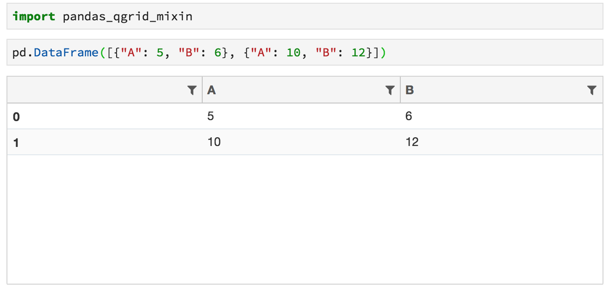

# pandas-qgrid-mixin

pandas/ipython mix-in to use Qgrid as default DataFrame display method

## What it does?

Injects `_ipython_display_` method into `pandas.DataFrame` that instead of the usual HTML table representation shows a `QgridWidget`.

## Install

```sh
pip3 install git+git://github.com/0xmjk/pandas-qgrid-mixin
```

## Example

```python
import pandas as pd
import pandas_qgrid_mixin

pd.DataFrame([{"A": 5, "B": 6}, {"A": 10, "B": 12}])
```



## Options

Additional `pandas.display` options:

| Option | Type | Default | Description |
| --- | --- | --- | --- |
| pandas.display.use_qgrid_doc | bool | True | Display DataFrames using QgridWidget instead of default HTML. |
| pandas.display.show_qgrid_options_doc | dict | {}| Kwargs for  grid.show_grid() |

## Links

* [Qgrid](https://github.com/quantopian/qgrid) is an interactive grid for sorting, filtering, and editing DataFrames in Jupyter notebooks
